# 概要
SmartPlasma は PL950対応の加工用ソフトウェアです。<br/>
シンプルなCAM機能を備え、DXFやSVGデータを読み込んで加工を行います。

---

<p align="center">
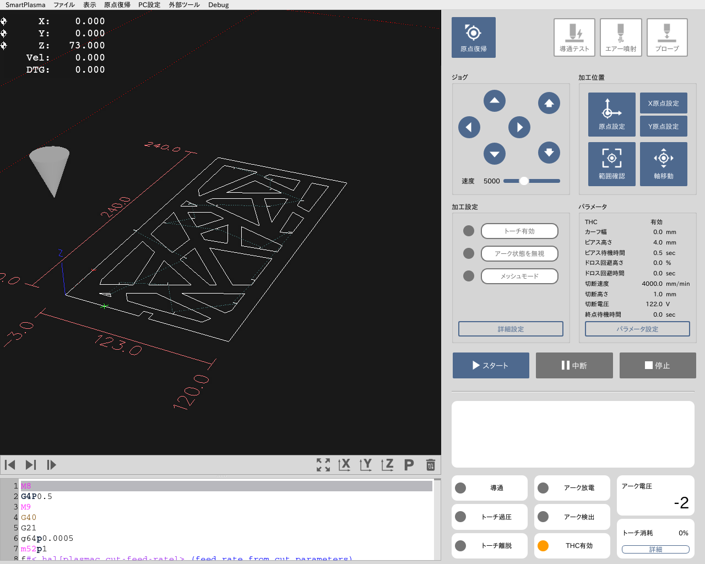
</p>

## 製品仕様
### 対応製品
PL950

### 対応ファイル
SVG / DXF (R12形式推奨) / G-Code

### ソフトウェアの動作要件
- 本製品に付属しているPCにインストールされております。
- ソフトウェア単体での配布は行っておりません。

## ご注意
- 本マニュアルのスクリーンショット等は実際のソフトウェアの表示と異なる場合がございます。
- 内容に関しては予告無しに更新されることがあります。
- 本製品の運用を理由とする損失、逸失利益などの請求につきましては、いかなる責任も負いかねますのであらかじめご了承ください。
- Microsoft Windowsは、米国 Microsoft Corporation の米国およびその他の国における登録商標または商標です。
- Apple、App Store、Apple ロゴ、Mac、Mac OS、OS X、macOS、iPad、iPhoto、iPod touch、および iTunes は、Apple Inc. の商標です。

<div style="page-break-before:always"></div>

# 各部名称・機能
## ソフトウェア画面
本ソフトウェアの基本ウィンドウで、以下の要素から構成されています。

<p align="center">
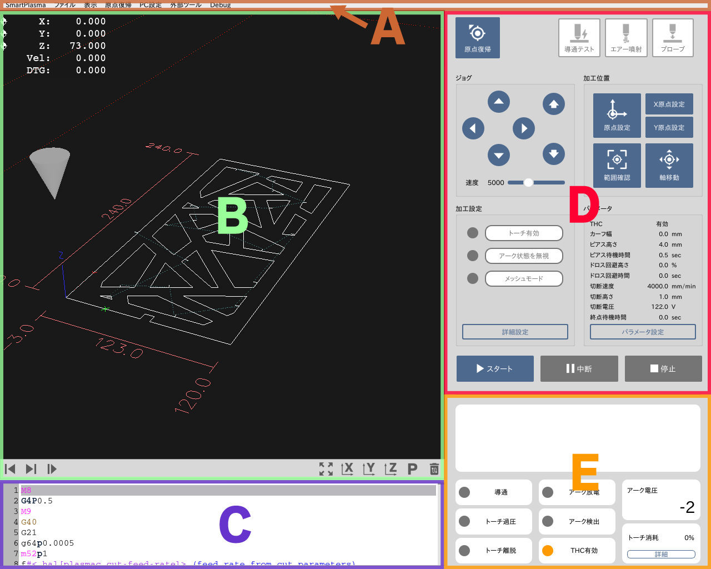
</p>

#### (A) メニューバー
メニューを選択することにより、様々な機能を実行させます。

#### (B) グラフィックエリア
加工経路やトーチの位置を表示しています。

#### (C) G-Code表示エリア
加工指示情報（G-Code）を表示しています。

#### (D) コントロールエリア
加工準備や加工操作を行うツールを表示しています。

#### (E) ステータスエリア
加工機の状態やエラーメッセージ等を表示しています。

<div style="page-break-before:always"></div>

# (A)メニューバー
ここでは、メニューバーの各項目について説明します。

## SmartPlasma
- SmartPlasmaについて: ソフトウェアのバージョン情報を確認できます。
- ソフトウェアアップデート: ソフトウェアのアップデートダイアログを開きます。
- SmartPlasma を終了: ソフトウェアおよびPCを終了します。

## ファイル
- ファイルを開く: 加工データを開きます。svg/dxf/nc/ngc形式のファイルのみ選択できます。
- 最近使用したファイル: 最近使用したファイルの一覧が表示されます。
- G-Codeを編集: G-Code表示エリアに表示されているG-Codeをテキストエディタで編集します。
- G-Codeを保存: G-Code表示エリアに表示されているG-Codeを保存します。

## 表示
- DROを表示: 現在の加工軸の座標や速度の表示/非表示を切り替えます。
- 詳細DROを表示: 標準DROと詳細DROの切り替えを行います。
- GCodeを表示: G-Code表示エリアの表示/非表示を切り替えます。
- 詳細ステータスを表示: 詳細ステータスの表示/非表示を切り替えます。

## 原点復帰
- 原点復帰: 全ての軸を原点復帰します。
- X軸原点復帰: X軸のみ原点復帰を行います。
- Y軸原点復帰: Y軸のみ原点復帰を行います。
- Z軸原点復帰: Z軸のみ原点復帰を行います。

## PC設定
- Wi-Fi設定: Wi-Fi接続の設定を行うダイアログを表示します。
- ネットワーク設定: PCのネットワーク情報の設定を行うダイアログを表示します。

## 外部ツール
- 計算機: 計算機アプリを起動します。
- スクリーンショット: スクリーンショットアプリを起動します。
- dxf2gcode: dxf2gcodeアプリを起動します。

<div style="page-break-before:always"></div>

# (B)グラフィックエリア
グラフィックエリアは主に加工データのプレビューや位置関係を確認するためのエリアです。

<p align="center">
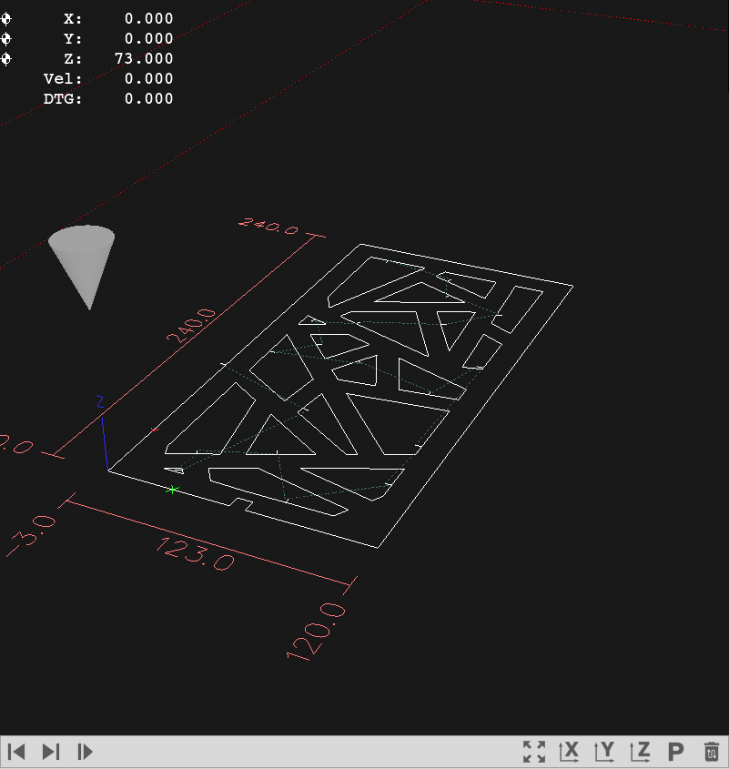
</p>

## DRO表示
エリア左上に表示されるDRO(Digiral Readout)の各項目について説明します。<br/>
この表示は「メニューバー > 表示 > DROを表示」から表示/非表示の切り替えができます。

- X: 加工原点からのX軸の相対座標を表示します。
- Y: 加工原点からのY軸の相対座標を表示します。
- Z: 加工原点からのZ軸の相対座標を表示します。（通常は考慮しません）
- Vel: 現在の速度（mm/min）を表示します。
- DTG: 次の移動点までの距離を表示します。

### 詳細表示
「メニューバー > 表示 > 詳細DROを表示」から詳細表示の切り替えができます。
- DTG X: 次の移動点までのX座標の距離を表示します。
- DTG Y: 次の移動点までのY座標の距離を表示します。
- DTG Z: 次の移動点までのZ座標の距離を表示します。
- G54 X: 加工原点のX軸の絶対座標を表しています。
- G54 Y: 加工原点のY軸の絶対座標を表しています。
- G54 Z: 加工原点のZ軸の絶対座標を表しています。（通常は考慮しません）
- G92 X: G92コマンドのXオフセットを表しています。（通常は使用しません）
- G92 Y: G92コマンドのYオフセットを表しています。（通常は使用しません）
- G92 Z: G92コマンドのZオフセットを表しています。（通常は使用しません）

## パス選択ツール

<p align="center">

</p>

加工パスを選択することができます。また、選択したパスからの加工が可能です。
- 前の移動点: 一つ前のパスを選択します。グラフィックおよびG-Codeビューがハイライトされます。
- 次の移動点: 一つ次のパスを選択します。グラフィックおよびG-Codeビューがハイライトされます。
- 選択位置から加工: 選択したパス（ハイライトされたG-Codeの行）から加工を行います。

```
途中から加工を行う場合は「M3」コードの前に必ず「G0」コードが含まれる位置から加工してください。
「G0」コマンド（移動）を実行せずに「M3」（切断開始）コードが実行されると、現在のトーチ位置から切断が開始されます。
```

## 視点ツール

<p align="center">

</p>

- 全体表示: 加工エリア全体表示の視点に切り替えます。
- X軸視点: 現在の加工データをターゲットに、X軸方向から見た視点に切り替えます。
- Y軸視点: 現在の加工データをターゲットに、Y軸方向から見た視点に切り替えます。
- Z軸視点: 現在の加工データをターゲットに、Z軸方向から見た視点に切り替えます。
- Z軸視点: 現在の加工データをターゲットに、Z軸方向から見た視点に切り替えます。
- 軌跡を消去: 表示されている軸の軌跡を消去します。


<div style="page-break-before:always"></div>

# (C)G-Code表示エリア
G-Code表示エリアでは現在の加工指示データ（G-Code）を表示しています。

<p align="center">

</p>

### 編集方法
「メニューバ > ファイル > G-Codeコードを編集」を実行するとテキストエディタが開きます。
このエディタ上で編集を行い上書き保存をすると、エディタを終了した際に変更が反映されます。

### 保存方法
「メニューバ > ファイル > G-Codeコードを保存」を実行すると現在のG-Codeを保存することができます。保存したG-Codeはファイルメニューから開くことができます。


## G-Codeのコマンドの定義
このソフトウェアは加工制御にLinuxCNCを利用しております。
G-Codeについてはこちらのマニュアルをご参考ください。
- [LinuxCNC Gcodes](https://linuxcnc.org/docs/html/gcode/g-code.html)
- [PlasmaC Gcode Examples](http://linuxcnc.org/docs/html/plasma/plasmac-user-guide.html#_plasmac_gcode_examples)


<div style="page-break-before:always"></div>

# (D)コントロールエリア
ここでは加工準備や加工操作を行うツールについて説明します。

<p align="center">

</p>

## 原点復帰
加工機・ソフトウェアを起動した直後は必ず原点復帰を行います。
この操作により、加工機が座標を認識することができます。


<p align="center">

</p>

## テスト操作

### 導通テスト
素材の導通チェックに使用できます。ジョグコマンドでトーチと素材を軽く接地し、このボタンをONにすると24Vの微小電流が流れます。
この状態でステータスエリアの「導通」がONになれば導通しています。

### エアー噴射
コンプレッサーの動作チェック等に使用できます。このボタンをONにするとエアー噴射コマンドが実行されます。

### プローブ
導通信号による素材の表面検出テストを行います。この動作の正しい挙動は下記の通りです。
1. トーチが`プローブ高さ`まで移動します。
2. トーチが`プローブ速度`で素材に近づいていきます。
3. トーチ先端と素材が接するとステータスエリアの「導通」がONになります。
4. トーチが`ピアス高さ`まで上昇します。

下記のような挙動では設定等を見直してください。
#### プローブ高さに移動するまでに素材に当たってしまう
トーチ先端と素材が速い速度で衝突すると、トーチの先端部品に悪影響を与える可能性があります。
`プローブ高さ`の設定値を調節し、`プローブ速度`で素材に当たるようにしてください。

#### 「導通」ステータスではなく「トーチ過圧」ステータスがONになる
導通されていない可能性があります。導通チェックを行ってください。

#### プローブ開始直後に停止する
トーチ先端に水滴が付着している可能性があります。
「エアー噴射」ボタンを押して先端の水滴を飛ばしてください。

<p align="center">
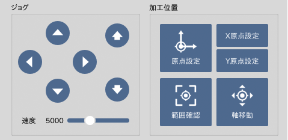
</p>

## ジョグ
加工軸を任意の位置に動かすことができます。
加工位置を設定する際などに使用します。

### 軸の移動
- ◀︎ ▶︎ ボタン : X軸を動かします。
- ▲ ▼ ボタン : Y軸を動かします。
- ↑ ↓ ボタン : Z軸を動かします。

キーボードからも操作を行うことが可能です。
- 矢印キー: XY軸を動かします。
- PageUp / PageDown: Z軸を動かします。※Fnキーを押しながら上または下矢印キーを押します。

### 速度の調整
- 速度スライダー: 動作速度を調整します。

また、キーボードの`Shift`ボタンで高速モード、`Alt`ボタンで低速モードになります。

## 加工位置
加工位置の設定や確認の際に使用します。

- 原点設定: 現在のトーチの位置を基準に加工原点を設定します。加工ファイルが読み込まれている状態で設定すると、グラフィックエリアの加工データの位置も反映されます。
- X原点設定: X軸のみ原点設定を行います。
- Y原点設定: Y軸のみ原点設定を行います。
- 範囲確認: 加工オブジェクトの外形をトーチが移動します。
- 軸移動: 数値で指定した任意の位置へトーチを移動します。


<p align="center">

</p>

## 加工設定
加工に関する設定を行います。加工を行う場合は「トーチ有効」をオンにしてください。

### トーチ有効
トーチの有効・無効を設定します。無効の場合は加工動作時にプラズマを発生させません。
安全のためデフォルトでは「オフ」の状態になっています。

### アーク状態を無視
この機能は主に「加工失敗時の再加工」などで使用します。
一度切断したラインをもう一度切断する場合、通常ではアーク検出が行われずに加工が中断されます。
この機能をオンにすると、アーク検出の状態にかかわらず加工が進みます。


## パラメータ
現在設定されている切断パラメータを表示しています。「パラメータ設定」ボタンをクリックするとパラメータ設定ウィンドウが表示されます。


<p align="center">

</p>

## 加工操作
- スタート: 加工を開始します。
- 中断/再開: 加工を一時停止/再開します。中断状態では「再開」ボタンに変わります。
- 停止: 加工をキャンセルします。


<div style="page-break-before:always"></div>

# (E)ステータスエリア
ここでは、ステータスエリアの各項目について説明します。


<p align="center">
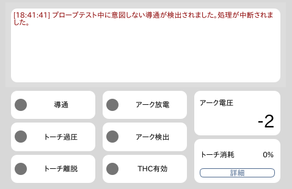
</p>

## エラーメッセージ
加工操作やG-Codeに問題がある場合は、このエリアにエラーメッセージが表示されます。

## ステータス

### 導通
導通回路が有効な状態（導通テストやプローブ時など）でトーチと素材が導通した場合にオンになります。

### トーチ過圧
トーチが素材に押し付けられた状態でオンになります。

### トーチ離脱
トーチマウントが外れた際にオンになります。

### アーク放電
プラズマ電源に対して出力信号を発している場合にオンになります。実際にアーク放電が行われるまで時差がある場合があります。

### アーク検出
アーク放電による電圧を検出した際にオンになります。

### THC有効
トーチ高さ自動制御（Torch Height Control）機能が有効になっている場合にオンになります。

### アーク電圧
検出されているアーク電圧が表示されます。この値は個体ごとに補正を行う必要があります。

### トーチ消耗
トーチの消耗品の使用度合いが表示されます。詳細ボタンをクリックすると累計切断時間やピアス回数などが確認できます。
トーチの消耗品を交換した場合はリセット操作を行ってください。

<div style="page-break-before:always"></div>

# パラメータ設定
ここでは、加工設定パラメータの詳細について説明します。

## パラメータ

### THC
トーチ高さ自動制御の有効/無効を設定します。
有効の場合、検出されるアーク電圧をもとにトーチの高さを微調整します。
素材の水平が確保できていない場合や、加工中に熱で反ってしまった場合などに効果を発揮します。

### カーフ幅
切断時の素材の消失幅を設定します。
付属のCAMソフトで「カーフ補正」を有効にした場合にのみ使用されるパラメータです。

### ピアス高さ
プラズマ切断加工では、まず素材に穴を開けてから切断加工を行います。
このピアス穴を開ける際のトーチの高さを設定します。

### ピアス待機時間
ピアス穴を開けるための待機時間を設定します。
- 加工結果を確認したがピアスが貫通していない場合、この時間を長くしてください。
- ピアス穴を開けている時にアーク検出がオフになった場合、この時間を短くしてください。

### 切断速度
切断加工時の移動速度を設定します。このパラメータは主に下記の結果に影響します。
- 切断深さ
- 素材の切断面の斜度
- 素材のカーフ幅
- 素材のドロス量

### 切断高さ
「THC有効」かつ「自動電圧オフ（詳細設定)」の場合以外に考慮されます。
加工時のトーチの高さを設定します。このパラメータは主に下記の結果に影響します。
- 素材の切断面の斜度
- 素材のカーフ幅
- 素材のドロス量

### 切断電圧
「THC有効」かつ「自動電圧オフ（詳細設定)」の場合に考慮されます。
加工時にこの設定電圧をターゲットとしてTHCが実行されます。
設定電圧が高いほど、THCによってトーチと素材の距離を開けるように制御されます。<br/>
※ 切断高さと同様の影響があります。

### 終点待機時間
主に厚めの素材を加工する際に設定します。
加工パスの終点付近が切断しきれていない場合はこの時間を増やします。

<div style="page-break-before:always"></div>

# CAMエディタ
ここでは Lead In/Out Editor について説明します。

SVGやDXFデータを読み込むとこのエディタが起動します。

<p align="center">

</p>

```
※ svgデータはデフォルトで 72dpi としてインポートされます。
※ dxfデータは 1単位 = 1mm としてインポートされます。
※ テキスト要素には対応しておりません。事前にアウトライン化やポリライン化を行ってください。
```
## 全体設定

### カッター補正
カーフ幅を考慮した自動補正のオン/オフを切り替えます。
この設定がオンの場合、加工時にSmartPlasma上で設定されたカーフ幅パラメータに基づいて自動でパスの補正が行われます。
この自動補正機能は万能ではなく、加工経路や補正幅によっては矛盾が生じて加工を行うことができません。
補正方向（パスの内側・外側）は下記のリード位置に基づいて決定されます。

### リード位置
リード開始・終了位置の内側/外側を選択します。
素材のスクラップ部分（不要部分）にリードパスがくるように設定してください。

### リードイン/リードアウト
リードのスタイル及び長さを設定します。厚い素材ほどリードを長く確保することをお勧めします。

### 円弧を線分に分割
円弧を細かい線分に分割して近似します。通常は使用する必要はありませんが、円弧の解釈に起因するデータの不整合が発生した場合はこのチェックを入れてお試しください。

## 個別設定
グラフィックエリアのパスをクリックすると、個別に上記の設定を行うことができます。

## データ出力
Exportボタンをクリックすると、SmartPlasmaに加工データが読み込まれます。

<div style="page-break-before:always"></div>

# 使い方
ここでは、実際にソフトウェアを起動し、加工を行うまでの流れを説明します。

## 素材の設置
加工機の加工エリア内に加工素材を設置します。

```
素材を加工エリア内に設置する際は、加工機の電装盤及びプラズマ電源をオフにするか、絶縁手袋を着用した上で行ってください。
```


## ソフトウェアの起動
加工機の電装盤の電源をオンにしてPCのスイッチを入れると、ソフトウェアが自動的に起動します。
ソフトウェアの起動に失敗する場合は、下記の項目をチェックしてください。
- 電装盤の電源がオンになっていること
- LANケーブルが正しく接続されていること


## 原点復帰
<p align="center">
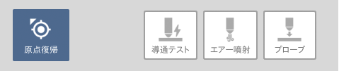
</p>

原点復帰ボタンをクリックし、加工軸を機械原点に移動します。

## 加工データの読み込み
<p align="center">

</p>

メニューバー > ファイル > ファイルを開く から加工データを読み込みます。
SVGやDXFデータの場合はCAMソフトが起動します。リードの設定などを行いG-Codeへの変換を行います。

## 加工位置の設定
<p align="center">

</p>

ここでは主に「ジョグ」「加工位置」グループを利用して加工位置を決定します。
1. ジョグ機能を使用してトーチを素材の上の任意の位置に移動させます。
2. 「原点設定」ボタンを押して加工原点を設定します。
3. 「範囲確認」ボタンを押して加工範囲を確認します。
4. 位置を調整する場合は 1. から再度実行します。
5. 最後に、テスト操作の「プローブ」ボタンをクリックして適切にプローブが行われることを確認します。

## 加工条件の設定
<p align="center">

</p>

ここでは主に「加工設定」「パラメータ」グループを利用して加工位置を決定します。
1. 「パラメータ設定」ボタンをクリックし、加工パラメータを設定します。
2. 「トーチ有効」のボタンをオンに設定します。
3. 「アーク状態を無視」は再加工時など必要に応じてオンに設定します。

## 加工動作
加工前に周囲の安全を十分に確認してください。

### 加工前の安全チェック項目

- プラズマ電源がオンになっており、電流値が適切に設定されている。
- コンプレッサーからエアーがきちんと供給されている。
- ウォーターベットに水が十分溜められている。
- 加工範囲が素材の大きさを超えていない。
- プローブテストが正しい動作で行われている。
- パラメータ及び加工設定の項目が適切に設定されている。
- 加工エリア内外に加工動作に干渉する障害物がない。
- 周辺環境および作業者自身の安全が十分に確保できている。
- 緊急停止ボタンが手の届くところに設置してある。

<p align="center">

</p>

スタートボタンをクリックすると加工が始まります。加工中は安全な位置に退避し、加工機から目を離さないでください。
加工を一時停止する場合は「中断」を、加工をキャンセルする場合は「停止」をクリックしてください。
トラブル等が発生し、直ちに動作を停止する必要がある場合は緊急停止ボタンをオンにしてください。

```
※加工条件の設定で「トーチ有効」をオフにした状態で加工をスタートすると、加工動作を事前に確認することができます。
```

## 作業終了
ソフトウェアの終了およびPCの電源をオフにします。<br/>
作業終了の前に、必要に応じて下記の操作を行ってください。
- 加工軸を任意の位置に移動します。
- 現在の加工データを メニューバー > ファイル > G-Codeを保存 から保存します。

全ての作業が終了したら、下記の手順で終了します。
1. メニューバー > SmartPlasma > SmartPlasmaを終了 からソフトウェアを終了します。
2. 電装盤の電源をオフにします。

<div style="page-break-before:always"></div>

# ネットワーク
ここではPCのネットワーク関連の設定について説明します。

## Wi-Fi設定
付属のWi-Fiアダプタを取り付けることで、お使いのWi-Fi環境にPCを接続することができます。

<p align="center">

</p>

1. メニューバー > PC設定 > Wi-Fi設定 を開きます。
2. 接続するWi-Fiを選択し「接続」ボタンをクリックします。
3. パスワードを入力します。

## ネットワークフォルダへのアクセス
上記の設定を行うと、同じWi-Fiネットワーク上のPCからこのPCのドキュメントフォルダにアクセスすることができます。

### Windowsの場合
<p align="center">
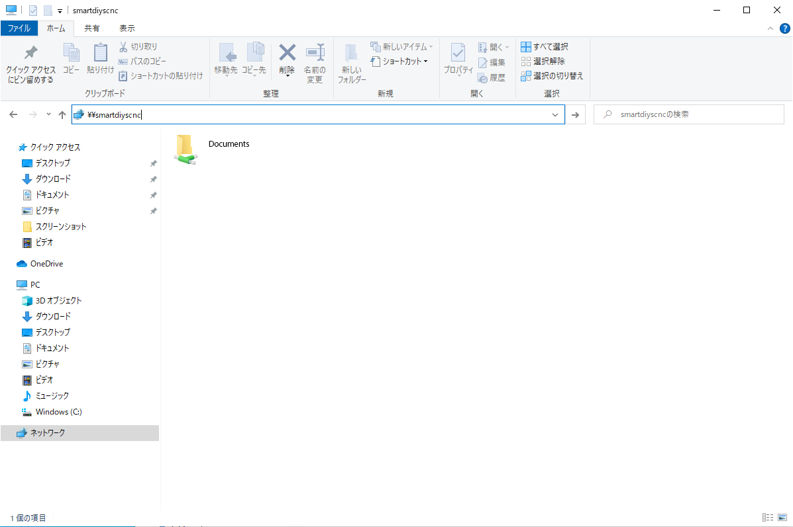
</p>

ネットワーク項目に表示されている「SMARTDIYSCNC」に接続するか、エクスプローラのアドレスバーに「¥¥smartdiyscnc」と入力してください。
### macOSの場合
<p align="center">
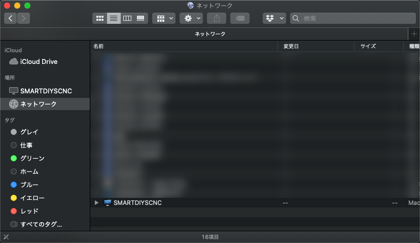
</p>

ネットワーク項目に表示されている「SMARTDIYSCNC」にアクセスし、Documentsフォルダを開いてください。

<div style="page-break-before:always"></div>

# 外部ツール
ここでは外部ツールについて説明します。

## 計算機
<p align="center">
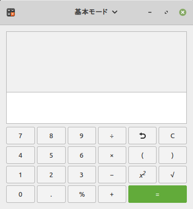
</p>

OSの計算機アプリです。様々なモードが含まれております。
数値計算などにご利用ください。

## スクリーンショット
<p align="center">

</p>

OSのスクリーンショット取得アプリです。
このアプリから現在の画面を画像として保存できます。
サポートへのお問い合わせ等にご利用ください。


## ファイルブラウザ
<p align="center">
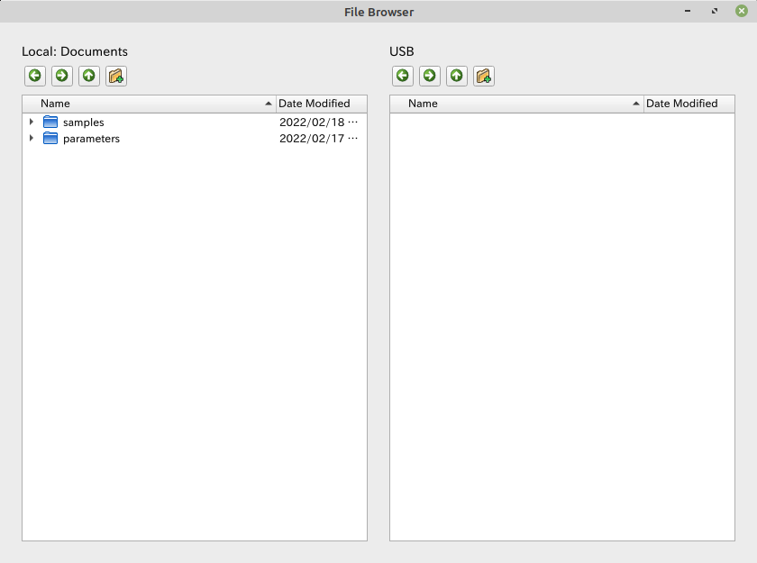
</p>

簡易的なファイルブラウザです。ドラッグ&ドロップでファイルの整理が可能です。
USBメモリからのデータ移行などにも利用できます。


## dxf2gcode
<p align="center">
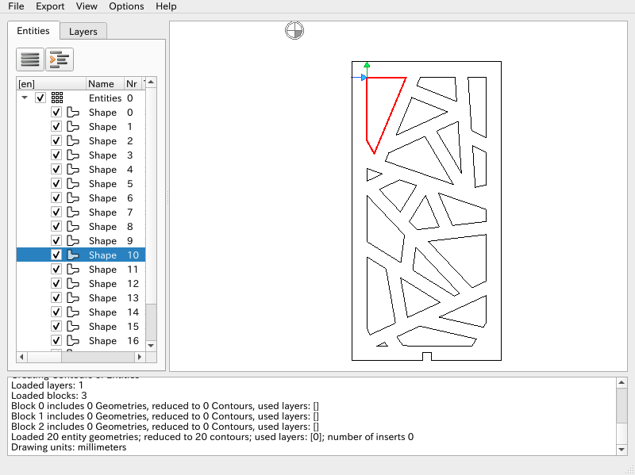
</p>

オープンソースソフトウェア「dxf2gcode」アプリです。
DXFデータからG-Codeに変換するためのCAMソフトウェアであり、ポストプロセッサの処理によりSmartPlasma用のG-Codeを書き出すことができます。

詳しい説明は下記のページをご参考ください。

- [DXF2GCODE WIKI](https://sourceforge.net/p/dxf2gcode/wiki/Home/)

ソフトウェアの各種設定は下記を参考にしてください。

### config

#### Machine config
- Slice depth: -1.50 mm
- Final mill depth: -1.00 mm


### postprocessor configuration

#### Software config
- Output file extenision: `.ngc`または`.ng`
- Export absolute coordinates: 有効
- Perform cutter compensation outside the piece: 有効
- Export only counter clockwise arcs: 無効

- Units in millimeters: G21 (Units in mm)
- Units in inch: G20 (Units in inches)
- Absolute programming: G90 (Absolute Distance Mode)
- incremental programming: G91 (Incremental Distance Mode)

- Startup:

```
%nl
G40 (cancel cutter compensation)
G49 (cancel tool length compensation)
G64 P0.05 (set path following to be within 0.05 of the actual path)
G80 (turn off canned cycle)
G92.1 (restore G92 offsets)
G94 (set feedrate mode)
G97 (set spindle control mode)
M52 P1 (set adaptive feed control)

M8
G4P0.5
M9
f#<_hal[plasmac.cut-feed-rate]> (feed rate from cut parameters)
```

- End:

```
%nlM30 (End of Program)
```

#### Output formatting
- Decimal separator: .
- Export line numbers: 無効

#### G-code codes
- Tool change: (空白)
- Feed rate change: (空白)
- Feed rate change: (空白)
- Rapid positioning for XY plane: `G0 X %XE Y %YE%nl`
- Rapid positioning for Z plane: (空白)
- Linear feed move for XY plane: `G1 X %XE Y %YE%nl`
- Clockwise feed move: `G2 X %XE Y %YE I %I J %J%nl`
- Counter clockwise feed move: `G3 X %XE Y %YE I %I J %J%nl`
- Disable cutter compensation: `G40%nl`
- Left cutter compensation: `G41.1 D#<_hal[plasmac_run.kerf-width-f]>%nl`
- Right cutter compensation: `G42.1 D#<_hal[plasmac_run.kerf-width-f]>%nl`
- Placed in front of any shape: `%nlM3 $0 S1%nl`
- Placed after any shape: `%nlM5 $0%nl`
- Comment for current shape: `%nl(%comment)%nl`

<div style="page-break-before:always"></div>

# ソフトウェアアップデート
ここでは、ソフトウェアのアップデート方法について説明します。

## インターネットからアップデート
PCがWi-Fi環境下でインターネットに接続されている場合、インターネットから直接アップデートを行うことができます。
1. メニュバー > SmartPlasma > ソフトウェアアップデート をクリックします。
2. 「インターネットからアップデート」をクリックします。
3. 最新バージョンの情報が取得され、確認ダイアログが表示されます。
4. アップデートを行います。
5. PCを再起動します。


## USBメモリからアップデート
PCがインターネットに接続されていない場合は、USBメモリからアップデートを行うことができます。

1. ネットワーク接続されているPCから、下記のURLにアクセスしてアップデートファイルをダウンロードします。<br>
https://www.smartdiys.com/manual/smart-plasma-releasenote/<br>
2. 空のUSBメモリを用意し、ダウンロードしたデータ（.plupd)をUSBメモリの一番上の階層に配置します。
3. 上記のUSBメモリをプラズマ加工機のPCに接続します。
3. メニュバー > SmartPlasma > ソフトウェアアップデート をクリックします。
4. 「USBメモリからアップデート」をクリックします。
3. USBメモリ内のアップデートファイルが認識され、確認ダイアログが表示されます。
4. アップデートを行います。
5. PCを再起動します。

<div style="page-break-before:always"></div>

# リリースノート
## 更新履歴

<table>
<thead>
<tr>
<th align="left">日時</th>
<th align="left">バージョン</th>
<th align="left">変更点</th>
<th align="left">ダウンロード</th>
</tr>
</thead>
<tbody>
<tr>
<td align="left">2022.11.22</td>
<td align="left">v1.0.4</td>
<td align="left">75Aプラズマ電源用パラメータ追加<br>USB挿入時のブラウザ表示の無効化<br>カスタムブラウザの追加<br>詳細ステータス確認表示の追加<br>軽微な不具合の修正</td>
<td align="left"><a href="https://download.smartdiys.com/smartplasma/archive/SmartPlasma_v1.0.4.plupd">v1.0.4</a></td>
</tr>
<tr>
<td align="left">2022.8.29</td>
<td align="left">v1.0.3</td>
<td align="left">CAMソフトのG2/G3コード出力への対応<br>数値指定での軸移動機能追加<br>警告表示に関する改善<br>軽微な不具合の修正<br>UI/UXの改善</td>
<td align="left"><a href="https://download.smartdiys.com/smartplasma/archive/SmartPlasma_v1.0.3.plupd">v1.0.3</a></td>
</tr>
<tr>
<td align="left">2022.3.1</td>
<td align="left">v1.0.2</td>
<td align="left">Z軸速度に関する改善<br>警告表示に関する改善</td>
<td align="left"><a href="https://download.smartdiys.com/smartplasma/archive/SmartPlasma_v1.0.2.plupd">v1.0.2</a></td>
</tr>
<tr>
<td align="left">2022.2.17</td>
<td align="left">v1.0.1</td>
<td align="left">軽微な不具合の修正</td>
<td align="left"><a href="https://download.smartdiys.com/smartplasma/archive/SmartPlasma_v1.0.1.plupd">v1.0.1</a></td>
</tr>
<tr>
<td align="left">2022.2.10</td>
<td align="left">v1.0.0</td>
<td align="left">正式版リリース</td>
<td align="left"><a href="https://download.smartdiys.com/smartplasma/archive/SmartPlasma_v1.0.0.plupd">v1.0.0</a></td>
</tr>
</tbody></table>

<div style="page-break-before:always"></div>
