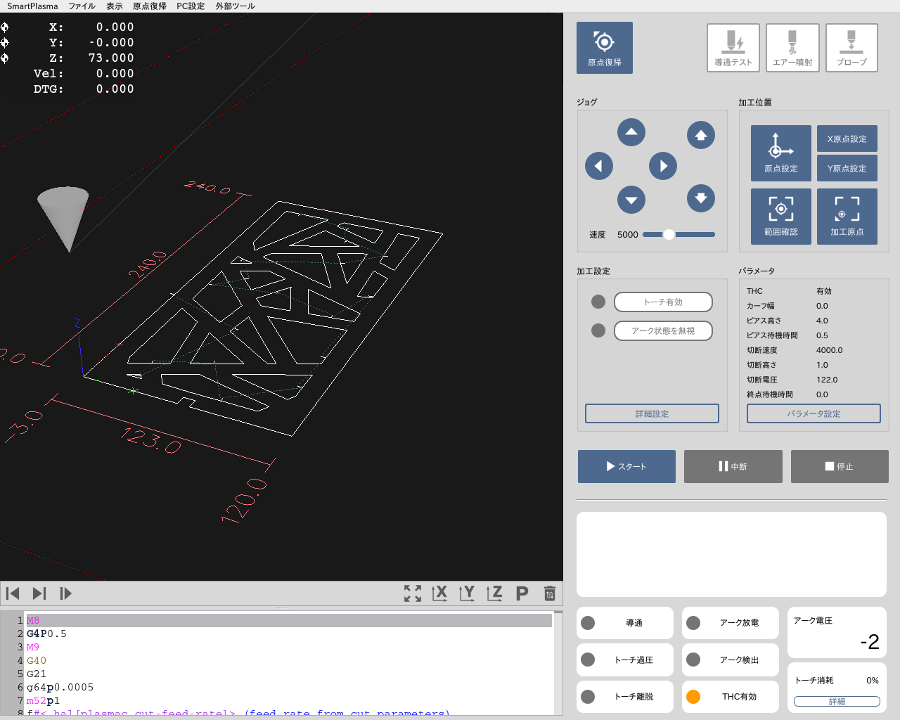

SmartPlasma は PL950対応の加工用ソフトウェアです。 
シンプルなCAM機能を備え、DXFやSVGデータを読み込んで加工を行います。

---

## 製品仕様
### 対応製品
PL950

### 対応ファイル
SVG / DXF (R12形式推奨) / G-Code

### ソフトウェアの動作要件
- 本製品に付属しているPCにインストールされております。
- ソフトウェア単体での配布は行っておりません。

## ご注意
- 本マニュアルのスクリーンショット等は実際のソフトウェアの表示と異なる場合がございます。
- 内容に関しては予告無しに更新されることがあります。
- 本製品の運用を理由とする損失、逸失利益などの請求につきましては、いかなる責任も負いかねますのであらかじめご了承ください。
- Microsoft Windowsは、米国 Microsoft Corporation の米国およびその他の国における登録商標または商標です。
- Apple、App Store、Apple ロゴ、Mac、Mac OS、OS X、macOS、iPad、iPhoto、iPod touch、および iTunes は、Apple Inc. の商標です。
