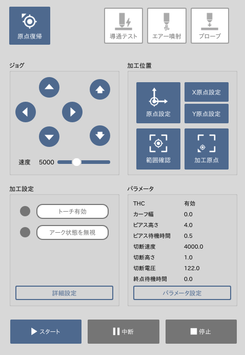
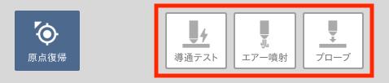
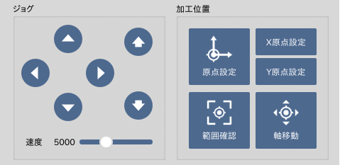

ここでは加工準備や加工操作を行うツールについて説明します。

## 原点復帰
加工機・ソフトウェアを起動した直後は必ず原点復帰を行います。
この操作により、加工機が座標を認識することができます。

## テスト操作

### 導通テスト
素材の導通チェックに使用できます。ジョグコマンドでトーチと素材を軽く接地し、このボタンをONにすると24Vの微小電流が流れます。
この状態でステータスエリアの「導通」がONになれば導通しています。

### エアー噴射
コンプレッサーの動作チェック等に使用できます。このボタンをONにするとエアー噴射コマンドが実行されます。

### プローブ
導通信号による素材の表面検出テストを行います。この動作の正しい挙動は下記の通りです。
1. トーチが`プローブ高さ`まで移動します。
2. トーチが`プローブ速度`で素材に近づいていきます。
3. トーチ先端と素材が接するとステータスエリアの「導通」がONになります。
4. トーチが`ピアス高さ`まで上昇します。

下記のような挙動では設定等を見直してください。
#### プローブ高さに移動するまでに素材に当たってしまう
トーチ先端と素材が速い速度で衝突すると、トーチの先端部品に悪影響を与える可能性があります。
`プローブ高さ`の設定値を調節し、`プローブ速度`で素材に当たるようにしてください。

#### 「導通」ステータスではなく「トーチ過圧」ステータスがONになる
導通されていない可能性があります。導通チェックを行ってください。

#### プローブ開始直後に停止する
トーチ先端に水滴が付着している可能性があります。
「エアー噴射」ボタンを押して先端の水滴を飛ばしてください。

## ジョグ
加工軸を任意の位置に動かすことができます。
加工位置を設定する際などに使用します。

### 軸の移動
- ◀︎ ▶︎ ボタン : X軸を動かします。
- ▲ ▼ ボタン : Y軸を動かします。
- ↑ ↓ ボタン : Z軸を動かします。

キーボードからも操作を行うことが可能です。
- 矢印キー: XY軸を動かします。
- PageUp / PageDown: Z軸を動かします。※Fnキーを押しながら上または下矢印キーを押します。

### 速度の調整
- 速度スライダー: 動作速度を調整します。

また、キーボードの`Shift`ボタンで高速モード、`Alt`ボタンで低速モードになります。

## 加工位置
加工位置の設定や確認の際に使用します。

- 原点設定: 現在のトーチの位置を基準に加工原点を設定します。加工ファイルが読み込まれている状態で設定すると、グラフィックエリアの加工データの位置も反映されます。
- X原点設定: X軸のみ原点設定を行います。
- Y原点設定: Y軸のみ原点設定を行います。
- 範囲確認: 加工オブジェクトの外形をトーチが移動します。
- 軸移動: 数値で指定した任意の位置へトーチを移動します。

## 加工設定
加工に関する設定を行います。加工を行う場合は「トーチ有効」をオンにしてください。

### トーチ有効
トーチの有効・無効を設定します。無効の場合は加工動作時にプラズマを発生させません。
安全のためデフォルトでは「オフ」の状態になっています。

### アーク状態を無視
この機能は主に「加工失敗時の再加工」などで使用します。
一度切断したラインをもう一度切断する場合、通常ではアーク検出が行われずに加工が中断されます。
この機能をオンにすると、アーク検出の状態にかかわらず加工が進みます。

## パラメータ
現在設定されている切断パラメータを表示しています。「パラメータ設定」ボタンをクリックするとパラメータ設定ウィンドウが表示されます。

## 加工操作
- スタート: 加工を開始します。
- 中断/再開: 加工を一時停止/再開します。中断状態では「再開」ボタンに変わります。
- 停止: 加工をキャンセルします。

