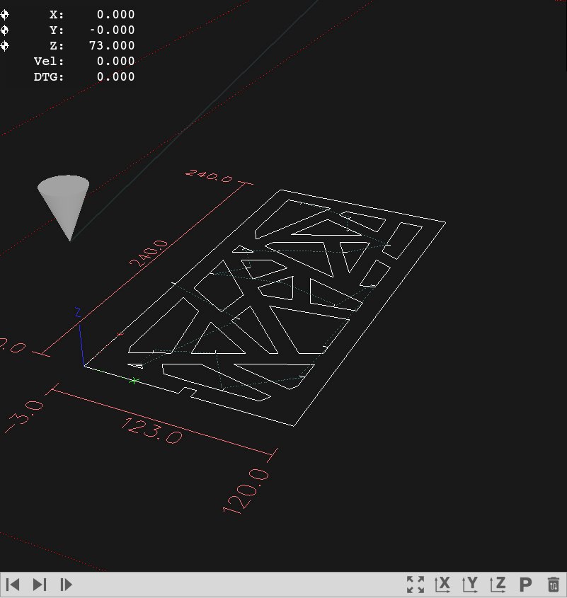

グラフィックエリアは加工データの配置や位置関係を確認するためのエリアです。
主に加工データの確認や加工位置の原点設定で使用します。

## DRO表示
DRO(Digiral Readout)の各項目について説明します。
「メニューバー > 表示 > DROを表示」から表示/非表示の切り替えができます。

- X: 加工原点からのX軸の相対座標を表示します。
- Y: 加工原点からのY軸の相対座標を表示します。
- Z: 加工原点からのZ軸の相対座標を表示します。（通常は考慮しません）
- Vel: 現在の速度（mm/min）を表示します。
- DTG: 次の移動点までの距離を表示します。

### 詳細表示
「メニューバー > 表示 > 詳細DROを表示」から詳細表示の切り替えができます。
- DTG X: 次の移動点までのX座標の距離を表示します。
- DTG Y: 次の移動点までのY座標の距離を表示します。
- DTG Z: 次の移動点までのZ座標の距離を表示します。
- G54 X: 加工原点のX軸の絶対座標を表しています。
- G54 Y: 加工原点のY軸の絶対座標を表しています。
- G54 Z: 加工原点のZ軸の絶対座標を表しています。（通常は考慮しません）
- G92 X: G92コマンドのXオフセットを表しています。（通常は使用しません）
- G92 X: G92コマンドのXオフセットを表しています。（通常は使用しません）
- G92 X: G92コマンドのXオフセットを表しています。（通常は使用しません）

## パス選択ツール
加工パスを選択することができます。また、選択したパスからの加工が可能です。
- 前の移動点: 一つ前のパスを選択します。グラフィックおよびG-Codeビューがハイライトされます。
- 次の移動点: 一つ次のパスを選択します。グラフィックおよびG-Codeビューがハイライトされます。
- 選択位置から加工: 選択したパス（ハイライトされたG-Codeの行）から加工を行います。

### 選択位置からの加工 について
途中から加工を行う場合は「G0」コマンド（移動）から加工を始める必要があります。

## 視点ツール
- 全体表示: 加工エリア全体表示の視点に切り替えます。
- X軸視点: 現在の加工データをターゲットに、X軸方向から見た視点に切り替えます。
- Y軸視点: 現在の加工データをターゲットに、Y軸方向から見た視点に切り替えます。
- Z軸視点: 現在の加工データをターゲットに、Z軸方向から見た視点に切り替えます。
- Z軸視点: 現在の加工データをターゲットに、Z軸方向から見た視点に切り替えます。
- 軌跡を消去: 表示されている軸の軌跡を消去します。

