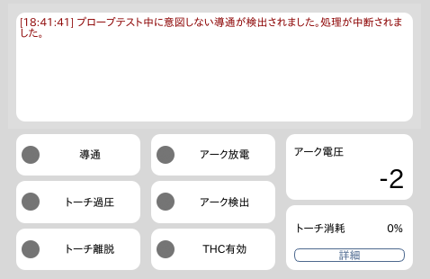

ここでは、ステータスエリアの各項目について説明します。

## エラーメッセージ
加工操作やG-Codeに問題がある場合は、このエリアにエラーメッセージが表示されます。

## ステータス

### 導通
導通回路が有効な状態（導通テストやプローブ時など）でトーチと素材が導通した場合にオンになります。

### トーチ過圧
トーチが素材に押し付けられた状態でオンになります。

### トーチ離脱
トーチマウントが外れた際にオンになります。

### アーク放電
プラズマ電源に対して出力信号を発している場合にオンになります。実際にアーク放電が行われるまで時差がある場合があります。

### アーク検出
アーク放電による電圧を検出した際にオンになります。

### THC有効
トーチ高さ自動制御（Torch Height Control）機能が有効になっている場合にオンになります。

### アーク電圧
検出されているアーク電圧が表示されます。この値は個体ごとに補正を行う必要があります。

### トーチ消耗
トーチの消耗品の使用度合いが表示されます。詳細ボタンをクリックすると累計切断時間やピアス回数などが確認できます。
トーチの消耗品を交換した場合はリセット操作を行ってください。
