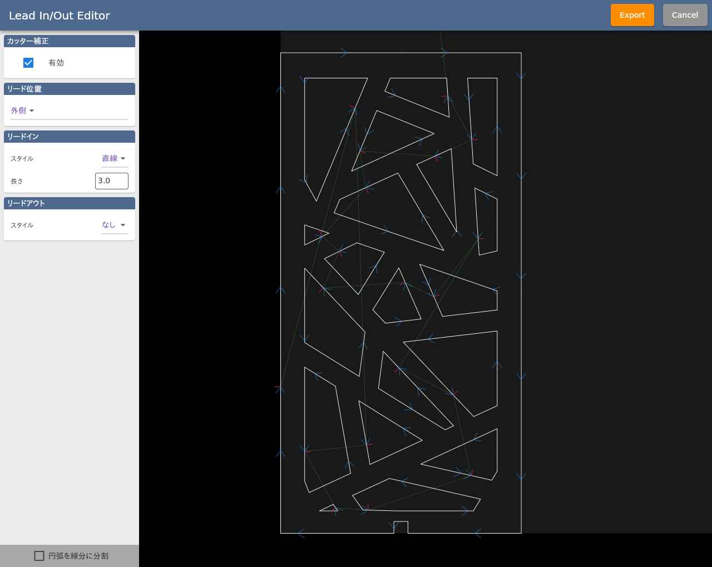

ここでは Lead In/Out Editor について説明します。

SVGやDXFデータを読み込むとこのエディタが起動します。

<p align="center">

</p>

```
※ svgデータはデフォルトで 72dpi としてインポートされます。
※ dxfデータは 1単位 = 1mm としてインポートされます。
※ テキスト要素には対応しておりません。事前にアウトライン化やポリライン化を行ってください。
```
## 全体設定

### カッター補正
カーフ幅を考慮した自動補正のオン/オフを切り替えます。
この設定がオンの場合、加工時にSmartPlasma上で設定されたカーフ幅パラメータに基づいて自動でパスの補正が行われます。
この自動補正機能は万能ではなく、細かいパスが存在する場合はエラーとなり加工を行うことができません。
補正方向（パスの内側・外側）は下記のリード位置に基づいて決定されます。

### リード位置
リード開始・終了位置の内側/外側を選択します。
素材のスクラップ部分（不要部分）にリードパスがくるように設定してください。

### リードイン/リードアウト
リードのスタイル及び長さを設定します。厚い素材ほどリードを長く確保することをお勧めします。

## 個別設定
グラフィックエリアのパスをクリックすると、個別に上記の設定を行うことができます。

## データ出力
Exportボタンをクリックすると、SmartPlasmaに加工データが読み込まれます。
