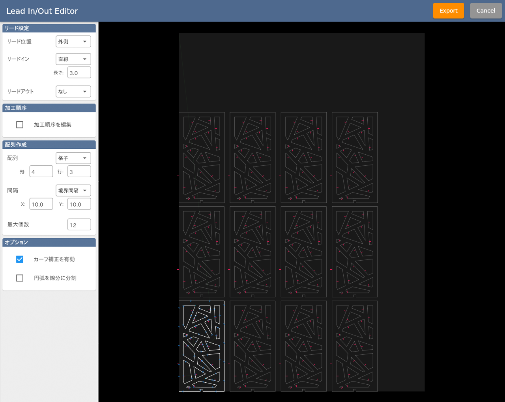

ここでは Lead In/Out Editor について説明します。

SVGやDXFデータを読み込むとこのエディタが起動します。

<p align="center">

</p>

```
※ svgデータはデフォルトで 72dpi としてインポートされます。
※ dxfデータは 1単位 = 1mm としてインポートされます。
※ テキスト要素には対応しておりません。事前にアウトライン化やポリライン化を行ってください。
```
## リード設定

### リード位置
リード開始・終了位置の内側/外側を選択します。
素材のスクラップ部分（不要部分）にリードパスがくるように設定してください。

### リードイン/リードアウト
リードのスタイル及び長さを設定します。厚い素材ほどリードを長く確保することをお勧めします。

## 配列作成

### 配列
配列の並べ方を指定します。

### 間隔
要素同士の配置間隔を指定します。

### 最大個数
配列要素の最大個数を指定します。

## オプション

### カーフ補正を有効
カーフ幅を考慮した自動補正のオン/オフを切り替えます。
この設定がオンの場合、加工時にSmartPlasma上で設定されたカーフ幅パラメータに基づいて自動でパスの補正が行われます。
この自動補正機能は万能ではなく、加工経路や補正幅によっては矛盾が生じて加工を行うことができません。
補正方向（パスの内側・外側）はリード位置に基づいて決定されます。

### 円弧を線分に分割
円弧を細かい線分に分割して近似します。
通常は使用する必要はありませんが、円弧の解釈に起因するデータの不整合が発生した場合はこのチェックを入れてお試しください。

## 個別設定
グラフィックエリアのパスをクリックすると、個別にリードスタイルやリード開始位置の設定を行うことができます。

## データ出力
Exportボタンをクリックすると、SmartPlasmaに加工データが読み込まれます。
