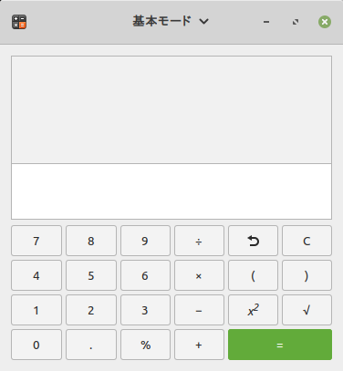
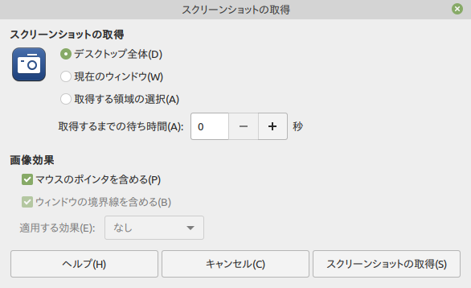
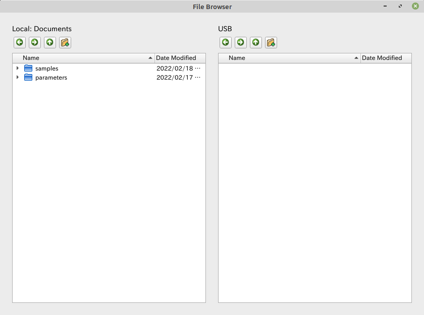
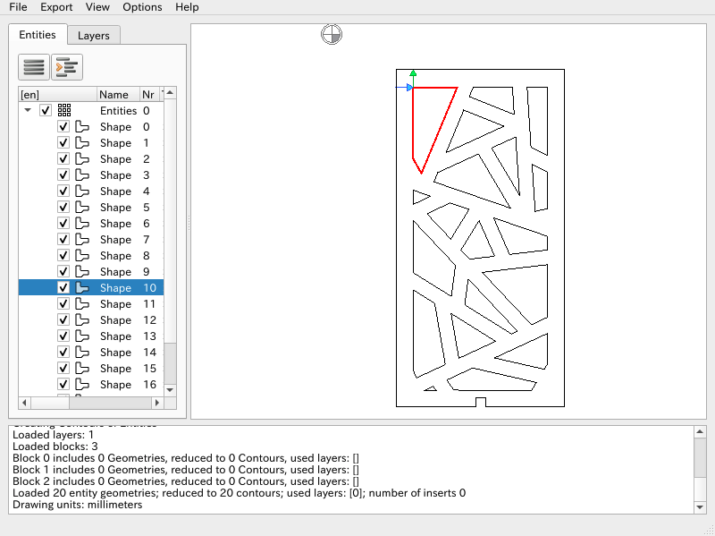

ここでは外部ツールについて説明します。

## 計算機
<p align="center">

</p>

OSの計算機アプリです。様々なモードが含まれております。
数値計算などにご利用ください。

## スクリーンショット
<p align="center">

</p>

OSのスクリーンショット取得アプリです。
このアプリから現在の画面を画像として保存できます。
サポートへのお問い合わせ等にご利用ください。


## ファイルブラウザ
<p align="center">

</p>

簡易的なファイルブラウザです。ドラッグ&ドロップでファイルの整理が可能です。
USBメモリからのデータ移行などにも利用できます。


## dxf2gcode
<p align="center">

</p>

オープンソースソフトウェア「dxf2gcode」アプリです。
DXFデータからG-Codeに変換するためのCAMソフトウェアであり、ポストプロセッサの処理によりSmartPlasma用のG-Codeを書き出すことができます。

詳しい説明は下記のページをご参考ください。

- [DXF2GCODE WIKI](https://sourceforge.net/p/dxf2gcode/wiki/Home/)

ソフトウェアの各種設定は下記を参考にしてください。

### config

#### Machine config
- Slice depth: -1.50 mm
- Final mill depth: -1.00 mm


### postprocessor configuration

#### Software config
- Output file extenision: `.ngc`または`.ng`
- Export absolute coordinates: 有効
- Perform cutter compensation outside the piece: 有効
- Export only counter clockwise arcs: 無効

- Units in millimeters: G21 (Units in mm)
- Units in inch: G20 (Units in inches)
- Absolute programming: G90 (Absolute Distance Mode)
- incremental programming: G91 (Incremental Distance Mode)

- Startup:

```
%nl
G40 (cancel cutter compensation)
G49 (cancel tool length compensation)
G64 P0.05 (set path following to be within 0.05 of the actual path)
G80 (turn off canned cycle)
G92.1 (restore G92 offsets)
G94 (set feedrate mode)
G97 (set spindle control mode)
M52 P1 (set adaptive feed control)

M8
G4P0.5
M9
f#<_hal[plasmac.cut-feed-rate]> (feed rate from cut parameters)
```

- End:

```
%nlM30 (End of Program)
```

#### Output formatting
- Decimal separator: .
- Export line numbers: 無効

#### G-code codes
- Tool change: (空白)
- Feed rate change: (空白)
- Feed rate change: (空白)
- Rapid positioning for XY plane: `G0 X %XE Y %YE%nl`
- Rapid positioning for Z plane: (空白)
- Linear feed move for XY plane: `G1 X %XE Y %YE%nl`
- Clockwise feed move: `G2 X %XE Y %YE I %I J %J%nl`
- Counter clockwise feed move: `G3 X %XE Y %YE I %I J %J%nl`
- Disable cutter compensation: `G40%nl`
- Left cutter compensation: `G41.1 D#<_hal[plasmac_run.kerf-width-f]>%nl`
- Right cutter compensation: `G42.1 D#<_hal[plasmac_run.kerf-width-f]>%nl`
- Placed in front of any shape: `%nlM3 $0 S1%nl`
- Placed after any shape: `%nlM5 $0%nl`
- Comment for current shape: `%nl(%comment)%nl`
