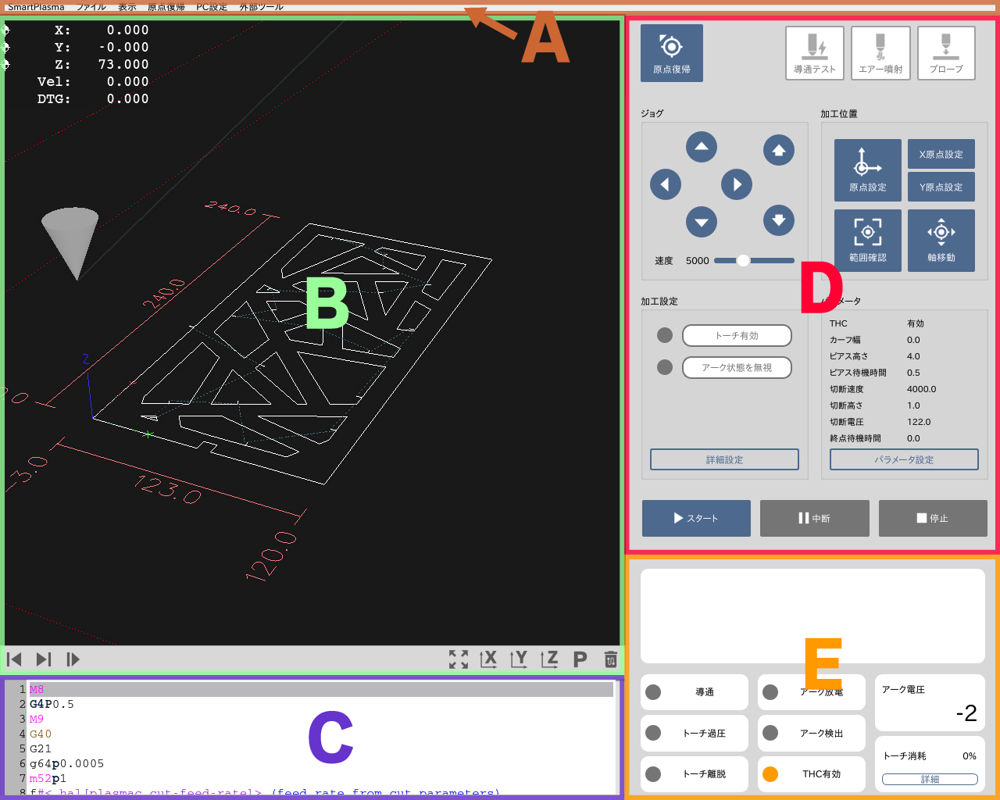

## ソフトウェア画面
本ソフトウェアの基本ウィンドウで、以下の要素から構成されています。

#### (A) メニューバー
メニューを選択することにより、様々な機能を実行させます。

#### (B) グラフィックエリア
加工経路やトーチの位置を表示しています。

#### (C) G-Code表示エリア
加工指示情報（G-Code）を表示しています。

#### (D) コントロールエリア
加工準備や加工操作を行うツールを表示しています。

#### (E) ステータスエリア
加工機の状態やエラーメッセージ等を表示しています。
