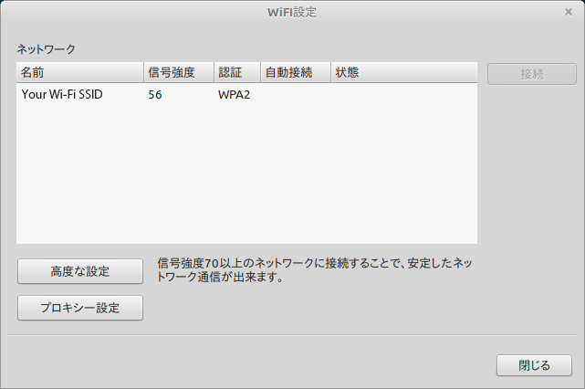
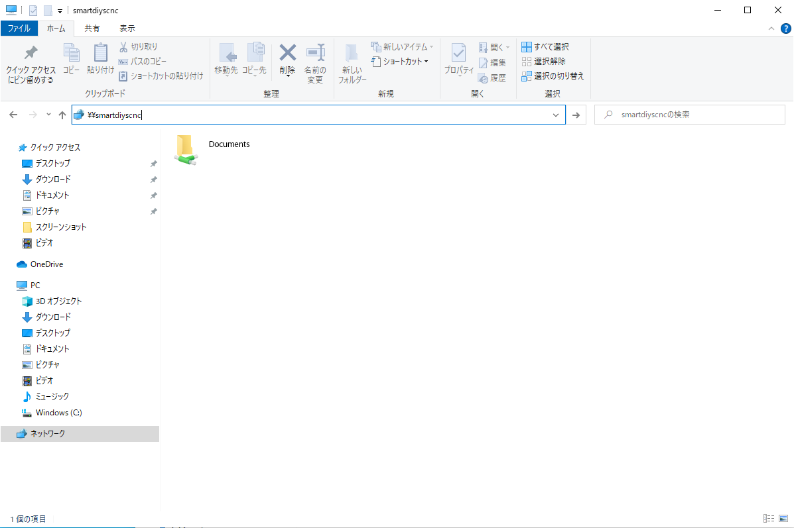
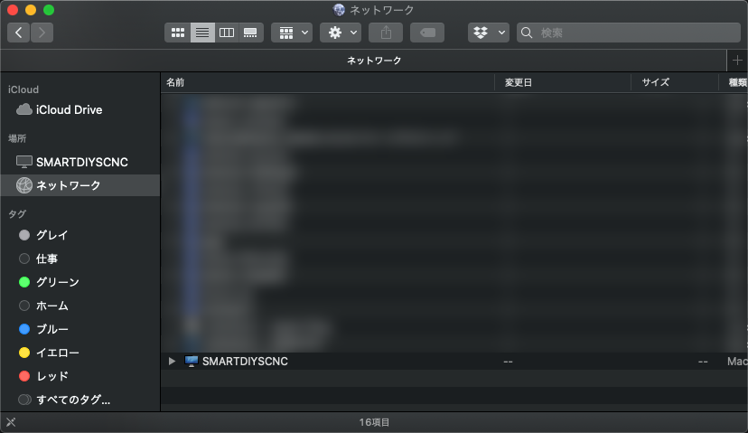

# ネットワーク

ここではPCのネットワーク関連の設定について説明します。

## Wi-Fi設定
付属のWi-Fiアダプタを取り付けることで、お使いのWi-Fi環境にPCを接続することができます。

1. メニューバー > PC設定 > Wi-Fi設定 を開きます。
2. 接続するWi-Fiを選択し「接続」ボタンをクリックします。
3. パスワードを入力します。

## ネットワークフォルダへのアクセス
上記の設定を行うと、同じWi-Fiネットワーク上のPCからこのPCのドキュメントフォルダにアクセスすることができます。

### Windowsの場合

ネットワーク項目に表示されている「SMARTDIYSCNC」に接続するか、エクスプローラのアドレスバーに「¥¥smartdiyscnc」と入力してください。
### macOSの場合

ネットワーク項目に表示されている「SMARTDIYSCNC」にアクセスし、Documentsフォルダを開いてください。
